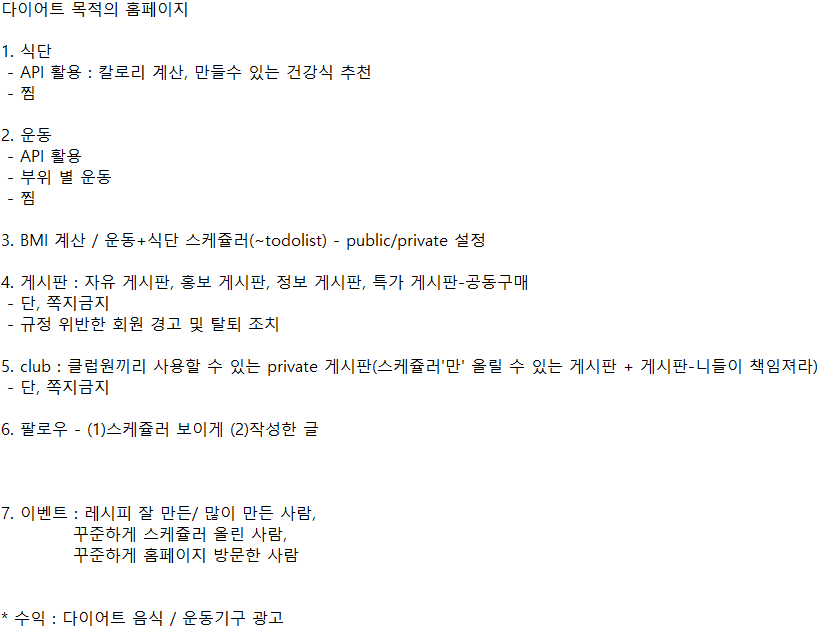
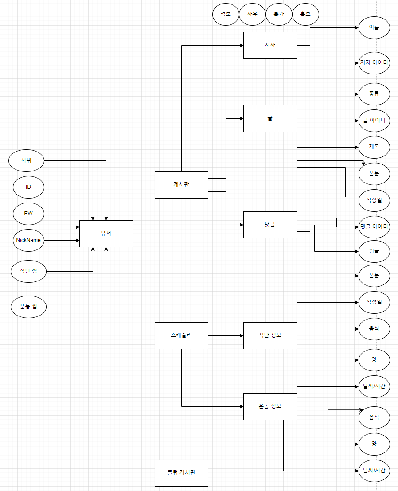
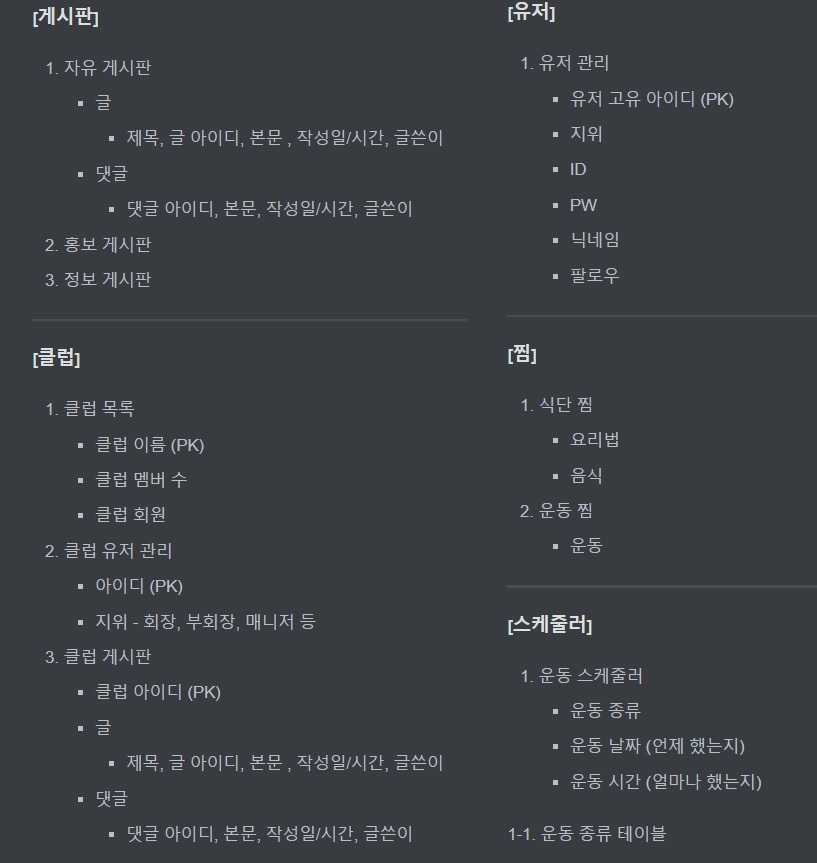
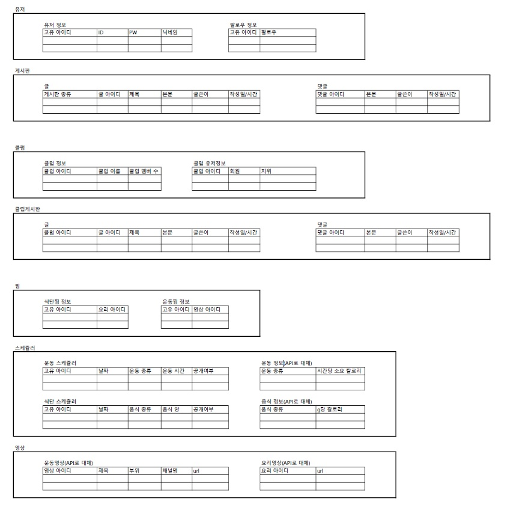

## 제목 : 최종 프로젝트 SSAFIT 진행안

## 참여자 : 고소왕 (고동훤, 김소현)

## 날짜 : 2022. 05. 17.

---

### 1. 개요

- DB 학습 
- 최종 프로젝트에 필요한 DB 개략 구축

### 2. 진행 상황

#### 1) DB 학습

- 유튜브를 통해 관계형 데이터 모델링 학습 후 notion에 내용 정리

- 링크 : [Notion](https://elfin-jasmine-65a.notion.site/bd7324f8850f4a03a592a7801d3374af)

#### 2) SSAFIT 기능 구현 초안 구축

​	

#### 3) DB 초안 구축

- 관계형 데이터베이스 모델링 draw.io로 그리기

  

  - Markdown으로 정리

    

  -  엑셀로 정리

    

    #### 3. 앞으로의 방향

    - 기능 축소 여부 고려 
    - 유사한 서비스를 제공하는 홈페이지가 많아 시장 조사 필요
    - 테이블 추가/삭제 검토

    #### 4. 느낀점

    :dog: 고동훤

    간단한 DB구조를 가지는 프로젝트를 진행할 때는 테이블의 구조나 관계를 고민할 필요가 없었다. 
    하지만 기능이 추가되면서 더 많은 테이블이 필요하게 되었고 따라서 처음으로 중소형 프로젝트를 진행하게 되면서 관계형 데이터 모델링을 진지하게 고민하게 되었다. 
    ERD부터 실제 테이블을 구상하는 것까지 생각보다 많은 시간이 소요되었지만 앞으로 프로젝트를 진행할 때 단단한 기본이 되어줄 것이라고 생각한다.

    :rabbit2: 김소현

    데이터베이스 구축은 어렵다. 테이블을 만드는 데 생각보다 많은 노고가 들어간다는 것을 알게 되었다. 좋은 페어를 만나 즐겁게 의견을 공유하며 진행할 수 있었다. 욕심내어 기능을 이것저것 추가하려다 보니 DB 구축이 버거워진 것 같아 기능 축소를 고려해 봐야 할 것 같다.

    